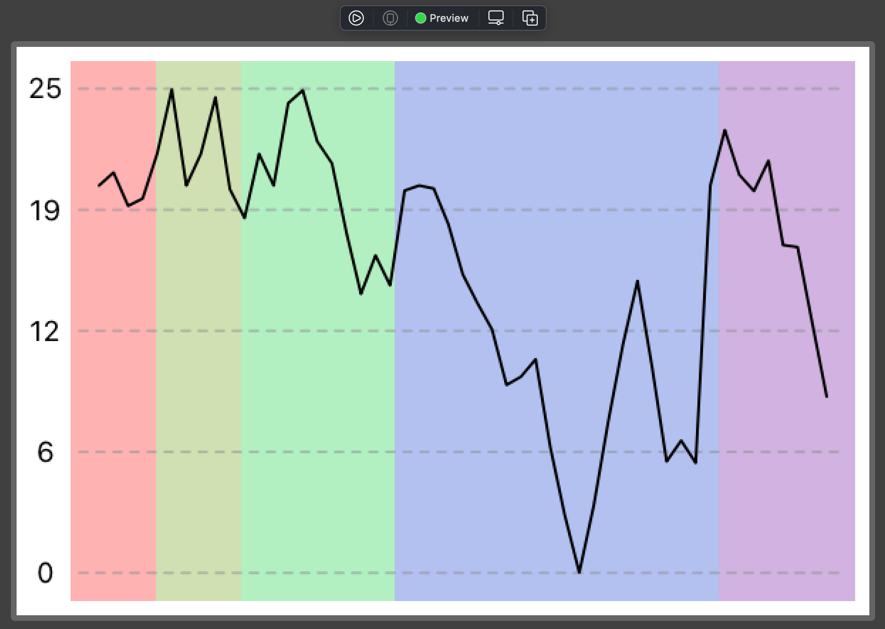

# Graph of heart rate measurements

This XCode project is a prototyping environment for a graph of heart rate measurements that will be used in my [Workout Spinner](https://github.com/jhrcook/Workout-Spinner-watchapp) watch application.

## API

The goal API is to just to instantiate the view with a [`WorkoutTracker`](https://github.com/jhrcook/HeartRateGraphDemo/blob/main/HeartRateGraphDemo/WorkoutTracker.swift) object.

```swift
var body: some View {
	HeartRateGraphView(workoutTracker: WorkoutTracker())
		.frame(width: 300, height: 200)
}
```

<center></center>
